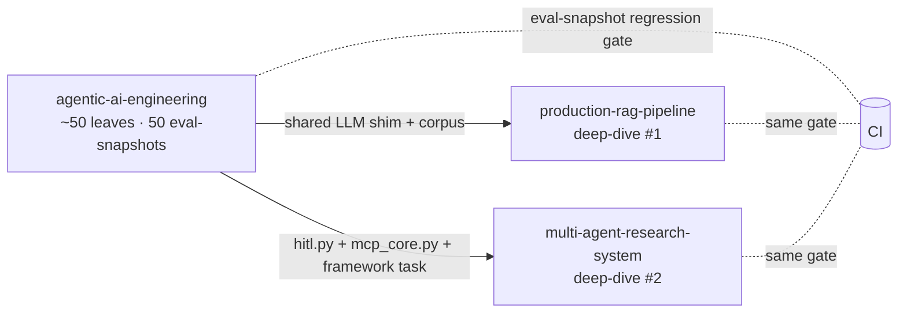

# agentic-ai-engineering

> A hands-on portfolio of agentic AI engineering — every major RAG technique, every major agent framework, human-in-the-loop patterns, indexing internals, evals, MCP, and deployment — all in one place, all runnable.

[](#)
[](#)
[](LICENSE)
[](#)

This is a **learning-first hub repo**. Each topic area is a folder with runnable notebooks, a small demo app, and committed eval snapshots so progress and tradeoffs are reviewable in git. Two flagship deep-dive repos prove the same skills in production form:

- 🚀 **[`production-rag-pipeline`](../production-rag-pipeline)** — production hybrid RAG with self-hosted Langfuse, RAGAS regression in CI, Streamlit chat, Fly.io deploy
- 🤖 **[`multi-agent-research-system`](../multi-agent-research-system)** — LangGraph supervisor + 5 specialists, HITL approval gates, MCP-only tools, Postgres checkpointer with time-travel



---

## 👀 If you have 5 minutes

Read these in order:

1. **[`docs/dashboard.md`](docs/dashboard.md)** — what shipped at a glance: 8 phases, 52 leaves, headline metrics per phase, auto-regenerated from committed `eval-snapshot.json` files.
2. **[`docs/leaderboard.md`](docs/leaderboard.md)** — every leaf with its committed eval numbers in one table.
3. **[`docs/leaves/`](docs/leaves/)** — every leaf's README + notebook **rendered inside the site** (no more clicking into GitHub). Browse `Dashboard → Leaderboard → click any leaf row` to read the full technique write-up + interactive notebook.
4. **[`docs/from-scratch.md`](docs/from-scratch.md)** — what we re-implemented instead of importing (~4 200 lines: in-process MCP server/client, mini-LangGraph with interrupt + time-travel, HNSW/IVF-PQ/BM25/ColBERT in NumPy, RAGAS-style metrics, LLM-as-judge, regression gate).
5. **[`docs/case-studies.md`](docs/case-studies.md)** — every leaf mapped to a real production problem (customer support, internal-API agents, code-aware Q&A, healthcare HITL, DevOps runbooks).
6. **[`docs/browser-execution.md`](docs/browser-execution.md)** — 39 of 52 notebooks **execute in your browser** with zero install via the bundled JupyterLite site (cached LLM responses; no API keys).

If you have 30 minutes: also skim **[`01-rag/12-comparison-bench/`](01-rag/12-comparison-bench/)** (RAG leaderboard), **[`03-agentic-frameworks/07-framework-comparison/`](03-agentic-frameworks/07-framework-comparison/)** (same agent in 7 frameworks), **[`docs/deep-dives/`](docs/deep-dives/)** (5 long-form articles), and **[`docs/architecture-decisions/`](docs/architecture-decisions/)** (6 ADRs).

---

## 🧭 Quick navigation

| Topic | Folder | What's inside |
|---|---|---|
| Foundations | [`00-foundations/`](00-foundations/) | Structured outputs, function calling, streaming, the 5 Anthropic workflow patterns |
| RAG | [`01-rag/`](01-rag/) | 13 techniques: naive → contextual chunking → hybrid → rerank → HyDE → Self-RAG → CRAG → Agentic → GraphRAG → Multimodal → Long-context |
| Indexing | [`02-indexing/`](02-indexing/) | Vector DB comparison + HNSW from scratch + IVF-PQ + BM25 + ColBERT + KG |
| Agentic frameworks | [`03-agentic-frameworks/`](03-agentic-frameworks/) | ReAct from scratch + LangGraph + Pydantic AI + CrewAI + MS Agent Framework + OpenAI Agents SDK + Smolagents + comparison |
| Human-in-the-loop | [`04-human-in-the-loop/`](04-human-in-the-loop/) | Interrupt/resume, approval gates, edit state, time-travel, async HITL via queue |
| Evals & observability | [`05-evals-and-observability/`](05-evals-and-observability/) | RAGAS (RAG + agent metrics), self-hosted Langfuse, LLM-as-judge, synthetic data, regression suite, cost/latency bench |
| MCP | [`06-mcp/`](06-mcp/) | Server, client, resources, custom MCP for a real API |
| Deployment | [`07-deployment-patterns/`](07-deployment-patterns/) | FastAPI streaming, Streamlit template, Docker compose, HF Spaces, Vercel AI SDK chat (TypeScript) |

---

## 🎯 Skills matrix *(complete; full table in [`docs/skills-matrix.md`](docs/skills-matrix.md))*

| Skill | Where to see it |
|---|---|
| RAG pipeline design (13 variants benchmarked) | `01-rag/`, `production-rag-pipeline` |
| Vector-DB selection & benchmarking | `02-indexing/00-vector-db-comparison/` |
| Index internals from scratch (HNSW, IVF-PQ, ColBERT) | `02-indexing/01-hnsw-deep-dive/`, `02-indexing/02-ivf-pq-quantization/`, `02-indexing/06-colbert-late-interaction/` |
| GraphRAG end-to-end | `01-rag/09-graph-rag/`, `02-indexing/04-knowledge-graph-index/` |
| Stateful agents (LangGraph + checkpointer) | `03-agentic-frameworks/01-langgraph/`, `multi-agent-research-system` |
| Type-safe agents (Pydantic AI) | `03-agentic-frameworks/02-pydantic-ai/` |
| Multi-agent orchestration | `03-agentic-frameworks/03-crewai/`, `multi-agent-research-system` |
| Same agent across 7 frameworks (side-by-side) | `03-agentic-frameworks/07-framework-comparison/` |
| HITL: interrupt/resume, approval gates, time-travel, async-via-queue | `04-human-in-the-loop/` (6 leaves) |
| Eval-driven dev (RAGAS RAG + agent metrics, judge, synthetic data, regression-in-CI, cost/latency) | `05-evals-and-observability/` (7 leaves) |
| Observability (self-hosted Langfuse + trace recorders) | `05-evals-and-observability/02-langfuse-tracing/` |
| MCP server + client + resources + custom-for-internal-API | `06-mcp/` (4 leaves) |
| FastAPI streaming agent (SSE) | `07-deployment-patterns/00-fastapi-streaming-agent/` |
| Docker Compose full stack (Postgres + pgvector + Redis + Langfuse) | `07-deployment-patterns/02-docker-compose-stack/` |
| TypeScript / edge (Next.js + Vercel AI SDK) | `07-deployment-patterns/04-ts-vercel-ai-sdk-chat/` |

---

## 🚀 Getting started

```bash
# 1. Clone
git clone <repo-url> && cd agentic-ai-engineering

# 2. Install uv (https://docs.astral.sh/uv/), then:
uv sync --group dev

# 3. Copy env template (most folders work without API keys via cached LLM responses)
cp .env.example .env

# 4. Install pre-commit hooks
uv run pre-commit install --hook-type pre-commit --hook-type commit-msg

# 5. Pick a folder, open its notebook, run.
```

Per-topic dependencies are installed on demand:

```bash
uv sync --group rag        # installs RAG-specific deps
uv sync --group frameworks # installs all agentic frameworks
# ... etc. See pyproject.toml [dependency-groups]
```

---

## 🗺️ Learning path

Recommended traversal order for someone learning end-to-end:

1. **`00-foundations/`** — structured outputs + function calling + the 5 workflow patterns
2. **`01-rag/00-naive-rag`** → **`01-rag/04-reranking`** — get a real RAG pipeline working
3. **`05-evals-and-observability/00-ragas-rag-eval`** — learn to measure before going further
4. **`01-rag/05-query-transformation`** → **`01-rag/12-comparison-bench`** — advanced RAG with measurement
5. **`02-indexing/`** — go deep on what's actually happening under the embeddings
6. **`03-agentic-frameworks/00-react-from-scratch`** then **`01-langgraph`**
7. **`04-human-in-the-loop/`** — make agents production-safe
8. **`06-mcp/`** — modern tool integration
9. **`07-deployment-patterns/`** — ship it

Full docs: see [`docs/learning-path.md`](docs/learning-path.md).

---

## 🛠️ Conventions

- **Notebooks** are the teaching artifact — code and markdown intuition stay in sync (see [`CONTRIBUTING.md`](CONTRIBUTING.md)).
- **Eval snapshots** (`eval-snapshot.json`) are committed for every folder that has measurable behavior so improvements/regressions are reviewable in git.
- **No API keys ever in cells.** Use `os.getenv(...)` + `.env`.
- **Conventional commits** enforced via `pre-commit`.

See [`CONTRIBUTING.md`](CONTRIBUTING.md) for the full leaf-folder template.

---

## 📦 Status

**Phases 0–8 complete.** Foundations + 13 RAG techniques + 8 indexing internals + 8 framework leaves + 7 eval/observability leaves + 6 HITL patterns + 4 MCP leaves + 5 deployment patterns are all in. Every leaf has a committed `eval-snapshot.json`; CI compares against `main` and fails PRs on > 5% regression. See [`PLAN.md`](PLAN.md) for the full roadmap and [`01-rag/README.md`](01-rag/README.md) for the live leaderboard.

**Phase 11 portfolio polish complete:** five long-form deep-dives in [`docs/deep-dives/`](docs/deep-dives/), six ADRs in [`docs/architecture-decisions/`](docs/architecture-decisions/), system diagrams in [`docs/architecture.md`](docs/architecture.md), and a soft-launch runbook in [`docs/launch-checklist.md`](docs/launch-checklist.md).

Building in public — follow along on:
- LinkedIn: *(link)*
- Twitter/X: *(link)*

---

## 🪪 License

MIT — see [`LICENSE`](LICENSE).
