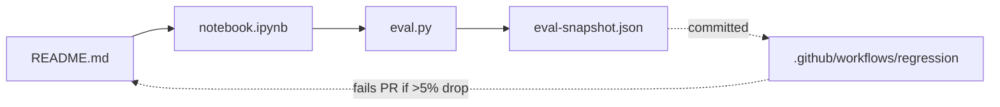
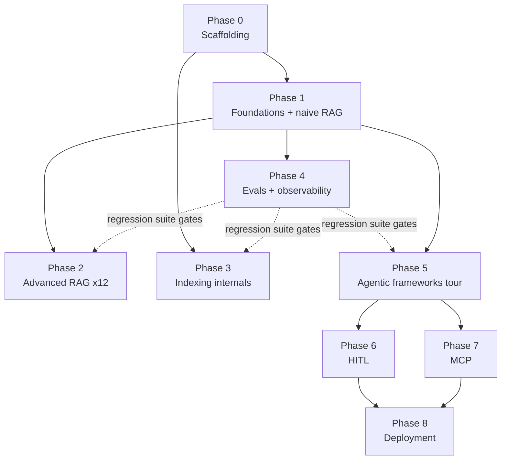
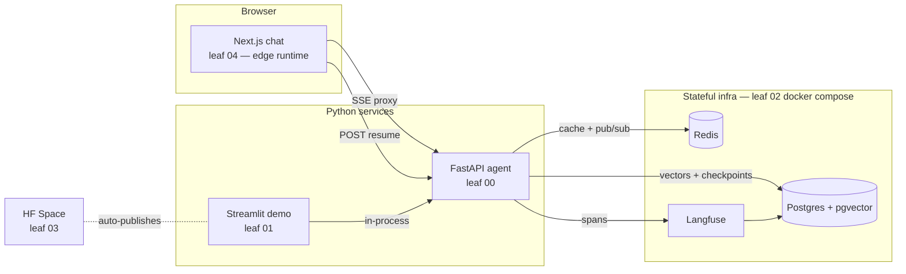
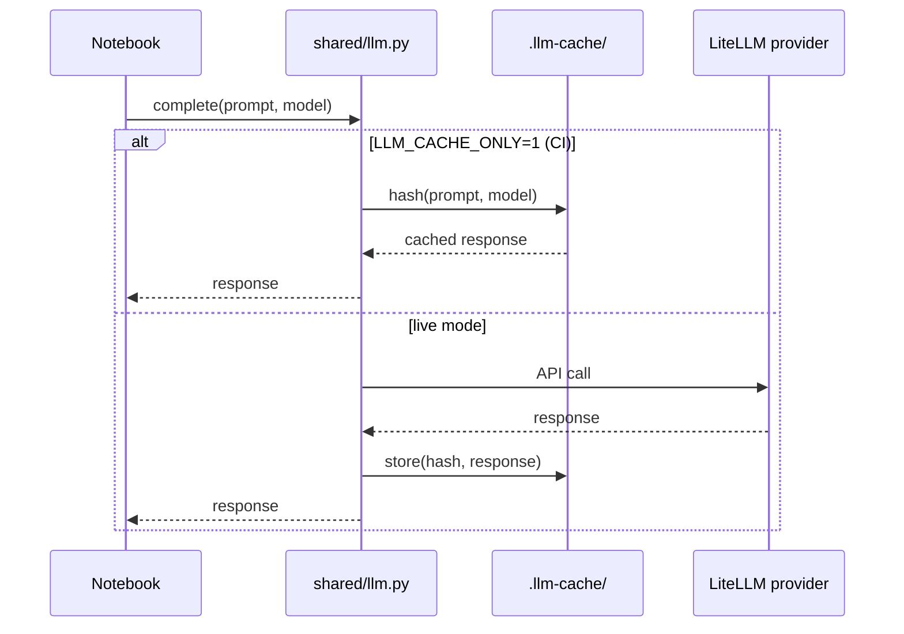
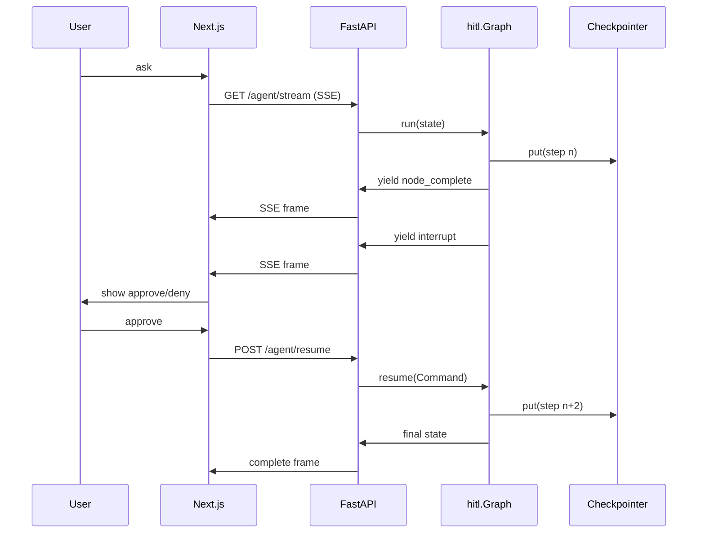
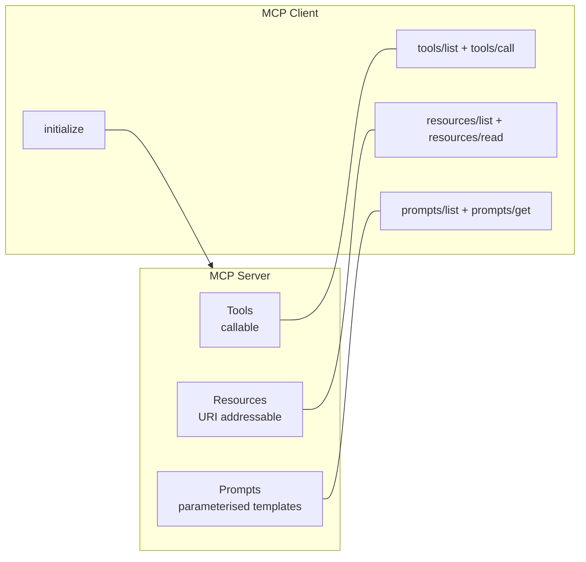

# Architecture

System-level diagrams for the hub repo. Each leaf has its own focused
diagram in its README — these are the cross-cutting views.

## The leaf shape — every folder ships the same four artefacts

## Layered dependency graph between phases

## Runtime architecture of the deployment stack

The five Phase 8 leaves compose into a working dev environment:

## The shared LLM shim — why CI never needs API keys

## HITL interrupt-and-resume — the pattern that survives HTTP

## MCP — three primitives that map cleanly to LangChain abstractions

