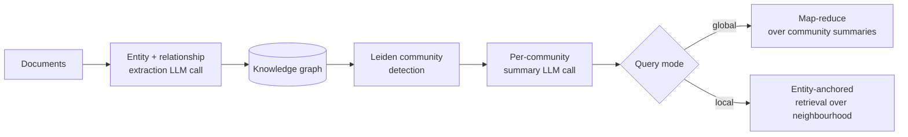

# GraphRAG — when entities beat chunks

> Source leaves: [`01-rag/09-graph-rag/`](../leaves/01-rag/09-graph-rag/index.md),
> [`02-indexing/04-knowledge-graph-index/`](../leaves/02-indexing/04-knowledge-graph-index/index.md).

## The problem GraphRAG actually solves

Naive RAG retrieves *chunks*. Chunks are great for "what did paper X say
about Y?" — the answer is plausibly inside one or two passages, you stuff
them into the prompt, the model summarises, you go home.

Chunks are terrible for **global questions**:

- *"What are the dominant themes across the last year of papers?"*
- *"Which authors collaborate most often on safety research?"*
- *"How has the field's stance on synthetic data evolved?"*

There is no single chunk that holds the answer. The information is
*distributed* across hundreds of documents, and you need an *index over
relationships*, not over text.

That's the niche GraphRAG (Microsoft, 2024) was built for: extract
entities and relationships, cluster them into **communities**, summarise
each community, and answer global queries from the summaries.

## How the canonical pipeline works

Two query modes drop out naturally:

* **Global search** — map over every community summary; reduce to one answer.
  Expensive but answers questions that touch the whole corpus.
* **Local search** — find the seed entities for the query, expand to the
  k-hop neighbourhood, retrieve only those chunks. Cheaper than global,
  better than naive for "who works with whom" style questions.

## Where the cost goes

The brutally honest cost model for GraphRAG over our `arxiv-cs.CL`
corpus (~500 papers, ~3000 chunks):

| Phase | LLM calls | Tokens | $ (gpt-4o-mini) |
|---|---:|---:|---:|
| Entity / relationship extraction | ~3000 | ~6 M | ~$1 |
| Community summarisation | ~150 | ~1.5 M | ~$0.30 |
| **Index total** | **~3150** | **~7.5 M** | **~$1.30** |
| Per global query | ~20–80 | ~200 k | ~$0.04 |

The index cost dwarfs queries — GraphRAG only pays off when you ask many
global questions against the same index, or when global answers are the
*only* thing that satisfies the user.

## When to reach for it

Use GraphRAG when **at least two** of these are true:

1. The user routinely asks for synthesis across the corpus.
2. The corpus is mostly stable (re-indexing on every change is expensive).
3. There's a natural entity layer (people, products, drugs, tickers).
4. The corpus is small enough (<10 k docs) that the index cost is tolerable.

Use **hybrid retrieval + reranking** ([`01-rag/03-hybrid-search`](../leaves/01-rag/03-hybrid-search/index.md)
+ [`01-rag/04-reranking`](../leaves/01-rag/04-reranking/index.md)) instead when the
queries are local and factual — that combo wins on cost *and* on the
RAG leaderboard for those question types.

## What our leaf actually demonstrates

The leaf is **offline-reproducible**: it uses cached LLM extraction
responses from `.llm-cache/01-rag/09-graph-rag/*.jsonl`, builds a
NetworkX graph, runs Leiden via `python-louvain` as a fallback, and
emits both local and global answers. The snapshot tracks:

* `entities_extracted`, `relationships_extracted`
* `communities` and `avg_community_size`
* `global_answer_faithfulness`, `local_answer_faithfulness`
* `tokens_per_query` and `index_tokens` (so the cost story is honest)

## What I'd change in production

* **Don't extract entities with the cheapest model.** The downstream
  graph is only as good as the extraction; spend the money once.
* **Cache entity normalisation aggressively.** Variants of "OpenAI" /
  "Open AI" / "OpenAI, Inc." will blow up your community count if you
  don't fold them.
* **Persist communities, not the raw graph.** Communities change slowly;
  re-summarise only when membership drifts > X%.

## References

- [Microsoft Research — GraphRAG paper](https://arxiv.org/abs/2404.16130)
- [`microsoft/graphrag`](https://github.com/microsoft/graphrag)
- [LlamaIndex KnowledgeGraphIndex](https://docs.llamaindex.ai/en/stable/examples/index_structs/knowledge_graph/KnowledgeGraphDemo/)
