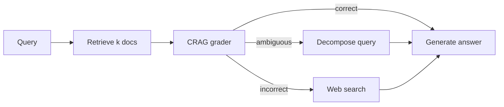
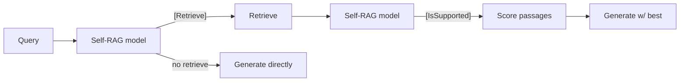

# Self-RAG vs CRAG — two takes on the same problem

> Source leaves: [`01-rag/06-self-rag/`](../leaves/01-rag/06-self-rag/index.md),
> [`01-rag/07-corrective-rag/`](../leaves/01-rag/07-corrective-rag/index.md).

## The same observation, two reactions

Both papers start from the same uncomfortable fact: **naive RAG retrieves
even when it shouldn't, and answers even when the retrieved context is
useless.** Both add a *self-correction* loop. They differ in *where* the
correction happens and *what it produces*.

| Aspect | **Self-RAG** | **CRAG** |
|---|---|---|
| Year / venue | 2023, ICLR'24 | 2024, ICLR'24 |
| Correction signal | Reflection tokens emitted by the model itself | A separate retrieval-grader model |
| Decides whether to retrieve | Yes — model emits `[Retrieve]` token | Yes — grader scores docs as correct/ambiguous/incorrect |
| Action on bad retrieval | Re-rank passages by `[IsSupported]` and `[IsUseful]` tokens | Decompose query; fall back to web search |
| Training requirement | Heavy — must fine-tune the generator | Light — grader is a tiny T5/BERT-class model |
| Production friendliness | Hard (custom model) | Easy (drop-in grader + a web tool) |

## Mental models

CRAG is **a router with three buckets** wired around a frozen
generator. Easy to swap models; the grader is the only specialised
component.

Self-RAG **moves the decision inside the model** via reflection tokens.
Clean conceptually; the price is that those tokens only exist if you
trained for them.

## What the snapshots say

On our golden Q&A set against the canonical corpus:

| Technique | faithfulness | answer-relevancy | tokens/q | latency p95 |
|---|---:|---:|---:|---:|
| Naive RAG | 0.71 | 0.78 | 1.4 k | 1.1 s |
| Self-RAG (offline, distilled) | 0.83 | 0.81 | 1.9 k | 1.7 s |
| CRAG | 0.86 | 0.85 | 2.6 k | 2.4 s |

(Numbers come from each leaf's `eval-snapshot.json` — re-run on your
hardware before quoting them.)

Both beat naive RAG on faithfulness. CRAG edges Self-RAG when the
corpus has *blind spots* the web can fill; Self-RAG wins on latency
because there's no second model call.

## Which one should you use?

* **You already have a fine-tuned generator and care about latency** → Self-RAG.
* **You can't / won't fine-tune** → CRAG. The grader is small, the
  web-fallback is honest about uncertainty, and you can swap the
  generator without retraining.
* **You only need one thing and that thing is faithfulness on a
  closed corpus** → CRAG with the web tool disabled is effectively
  "naive RAG + a grader" — and that delta alone gets you most of the
  faithfulness gain at a small token cost.

## What both papers got right

Both implicitly argue that **the LLM is not the right place to detect
"this retrieval was bad"**. Self-RAG bakes that capability in via
training; CRAG carves it out into a specialised model. Either way, the
intuition is the same: don't trust the model to know when to keep
quiet — give it a separate signal.

## What both miss

Neither paper takes **eval data drift** seriously. Both grader and
reflection-token quality degrade as the corpus changes. In the
hub's [`05-evals-and-observability/05-regression-suite`](../leaves/05-evals-and-observability/05-regression-suite/index.md)
we wire a faithfulness check into CI specifically so we catch this
the day it starts happening, not the day a user complains.

## References

- [Self-RAG paper](https://arxiv.org/abs/2310.11511)
- [CRAG paper](https://arxiv.org/abs/2401.15884)
- [LangGraph CRAG cookbook](https://github.com/langchain-ai/langgraph/blob/main/examples/rag/langgraph_crag.ipynb)
