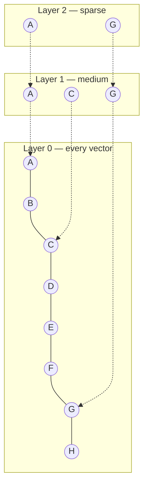

# HNSW internals — read the graph, don't trust the library

> Source leaves: [`02-indexing/01-hnsw-deep-dive/`](../leaves/02-indexing/01-hnsw-deep-dive/index.md),
> [`02-indexing/00-vector-db-comparison/`](../leaves/02-indexing/00-vector-db-comparison/index.md).

## Why bother understanding HNSW?

You can use FAISS / Qdrant / Chroma / pgvector without ever opening the
HNSW paper. You should not, because three of the questions that come up
in production are unanswerable without the mental model:

1. *"My recall dropped after a re-build with no code change. Why?"*
2. *"Why is `ef_search` knob more useful than `M`?"*
3. *"How do I size a node? RAM-bound? CPU-bound?"*

The leaf implements HNSW from scratch in NumPy. ~150 lines. The point
isn't to compete with FAISS — it's to make the algorithm legible.

## The picture



HNSW is a **multi-layer proximity graph**. Layer 0 contains every
vector and every node has many neighbours. Each higher layer subsamples
the layer below by `1/exp(1)` and keeps fewer edges. Search starts at
the top, greedily walks toward the query, then drops a layer and
repeats.

The two knobs you actually tune:

* **`M`** — number of neighbours per node. Larger graphs cost more RAM
  and more build time; recall improves to a plateau around M ∈ [16, 64].
  Hard to change once set without a rebuild.
* **`ef_search`** — beam width during the greedy walk at query time.
  *This is the one you tune live.* Set high for accuracy, low for
  latency, do it per-query if you want.

## What our snapshot actually shows

Running the leaf on a tiny dataset (10 docs, 26 questions, dim=64)
makes the recall/ef curve impossible to miss:

```json
"recall_vs_flat": {
  "ef=1":  0.20,
  "ef=2":  0.38,
  "ef=4":  0.76,
  "ef=8":  0.99,
  "ef=16": 1.00
},
"query_latency_us": {
  "ef=1":  103.68,
  "ef=2":   94.25,
  "ef=4":   96.43,
  "ef=8":  102.02,
  "ef=16":  99.56
}
```

**At dim=64 and 10 docs, latency barely moves.** Recall does. Two
takeaways travel directly to production:

1. *Always plot recall vs. `ef_search`* on your real data and pick the
   knee, not a number from a blog post. Knees move with dimensionality,
   document count, and embedding model.
2. *Always cross-check against a flat (exhaustive) baseline* during
   index validation. Pick a sample of queries and compute recall@k
   against the brute-force result. If it ever drops below your target,
   you have a real bug.

## Answers to the three production questions

**1. "Recall dropped after a rebuild."** Almost always: insertion order
changed and your `M` is too small to absorb the new local density. Fix
by raising `M`, or by inserting in a deterministic order that respects
the natural clustering.

**2. "Why is `ef_search` better than `M`?"** Because `ef_search` is
free at index time. `M` baked the cost into the graph already; you can
only raise it by rebuilding.

**3. "RAM-bound or CPU-bound?"** RAM in steady state — each layer-0
node holds ~`M * 4` bytes of neighbour IDs plus the vector itself.
CPU at build time and at query time near the knee. **The vector
storage is the dominant cost** for d ≥ 384, which is most real
embeddings.

## Why I keep coming back to a from-scratch implementation

Because seven months from now, when a recall regression hits at 11pm,
you do not want to discover that you don't understand why `ef_search`
matters. The 150-line leaf is the cheapest possible insurance against
that night.

## References

- [HNSW paper (Malkov & Yashunin, 2018)](https://arxiv.org/abs/1603.09320)
- [hnswlib reference impl](https://github.com/nmslib/hnswlib)
- [Qdrant — HNSW tuning guide](https://qdrant.tech/articles/hnsw-improvements/)
