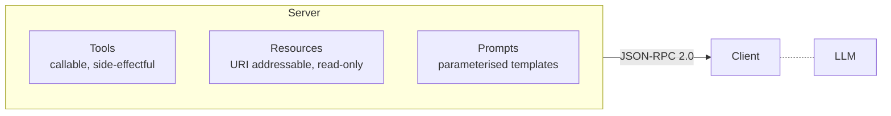

# MCP — three primitives that reshape your tool surface

> Source leaves: [`06-mcp/`](../leaves/06-mcp/index.md) (00 server-basics + 01
> client-in-agent + 02 with-resources + 03 custom-for-internal-api).

## The argument in one paragraph

Most agent codebases treat **tools** as a function-calling problem.
That collapses two things that should be separate: *what the agent
can do* (the tools), *what the agent can read* (the context), and
*what the agent should be told* (the prompts). MCP — the Model
Context Protocol from Anthropic, 2024 — gives you all three as
first-class server primitives, accessed over a tiny JSON-RPC 2.0
surface.

## The three primitives

* **Tools** are functions the model calls. Same shape as OpenAI tools
  except declared once on the server, discoverable via `tools/list`.
* **Resources** are addressable read-only content. URIs like
  `arxiv://synth-001` or `s3://reports/2026-q1.pdf`. Reachable via
  `resources/list` + `resources/read`. **This is the primitive most
  codebases lose** — it lets the LLM *enumerate* what's available.
* **Prompts** are parameterised templates owned by the server.
  Clients render via `prompts/get`. The system-prompt drift problem
  ("which version did we ship?") becomes the same problem as any
  server-side config drift, with the same answers.

## Why this matters in practice

In a typical native-tool agent, **tool definitions, the system prompt,
and the corpus the model can browse all live in different files in
different repos owned by different teams.** Drift is the default
state.

With MCP, those three concerns live in one server with one version,
one audit trail, one auth boundary, one rate limit. The agent just
asks the server *"what can I do, read, and say?"* at the start of
each session.

That's an architectural win, not a syntactic one.

## What the hub's `mcp_core.py` actually does

To keep the leaves offline-reproducible (no `mcp` SDK install needed),
the hub ships **`06-mcp/mcp_core.py`** — a pure-Python
in-process JSON-RPC 2.0 implementation:

* `Server` registers tools, resources, prompts. Tracks an audit log
  for every request — useful for proving canonical method coverage in
  the snapshot.
* `Client` connects via an in-process `Transport` (no socket).
* `build_corpus_server(with_resources, with_prompts)` is the factory
  every leaf uses so demos compose cleanly.
* `mcp_agent_solve(client, question)` is a deterministic agent loop —
  its trace shape mirrors the [agentic-frameworks `task.py`](../leaves/03-agentic-frameworks/index.md)
  so an MCP-driven snapshot is directly comparable to native-tool
  snapshots.

## The four leaves and what they prove

| Leaf | What it proves |
|---|---|
| `00-mcp-server-basics` | Initialize handshake works; tool schemas validate; canonical method coverage = 1.0 |
| `01-mcp-client-in-agent` | Tool-call accuracy = 1.0 on the same task as native-tool agents (no measurable cost to MCP) |
| `02-mcp-with-resources` | Resources `list` / `read` round-trip; parameterised prompts render with the right roles |
| `03-custom-mcp-for-internal-api` | A verbose internal API gets a small, opinionated agent-facing surface; payload trim ratio ~60%; rate-limit enforced |

The snapshot for leaf 03 explicitly tracks `payload_trim_ratio` because
this is the daily value MCP adds in production: **the agent sees a
clean small surface, not the raw upstream firehose**.

## When NOT to use MCP

* **Single-purpose tools.** If you have one tool and never plan to
  have more, the MCP server adds ceremony.
* **Hot inner-loop functions inside the same process as the agent.**
  JSON-RPC has overhead; if you're calling the tool 1000× per second,
  call the function directly.

## The MCP migration pattern

For most internal APIs the migration path is:

1. Wrap the API in a *thin* MCP server. Trim the payload.
2. Move the prompt that taught the LLM how to use the API onto the
   server as a `prompts/get` template.
3. Promote your "context library" (docs, configs, schemas) to
   `resources/*` URIs.
4. Now the agent prompt is one paragraph: *"Use the MCP server at
   `internal-tools://*`."*

That's the goal state. The leaves walk you through every step.

## References

- [Anthropic — Model Context Protocol announcement](https://www.anthropic.com/news/model-context-protocol)
- [MCP spec](https://modelcontextprotocol.io/specification)
- [FastMCP — production server framework](https://github.com/jlowin/fastmcp)
